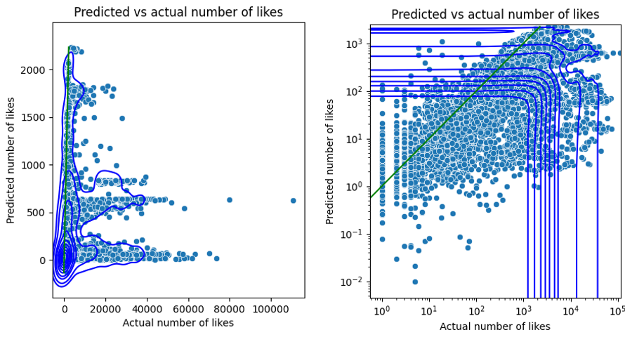
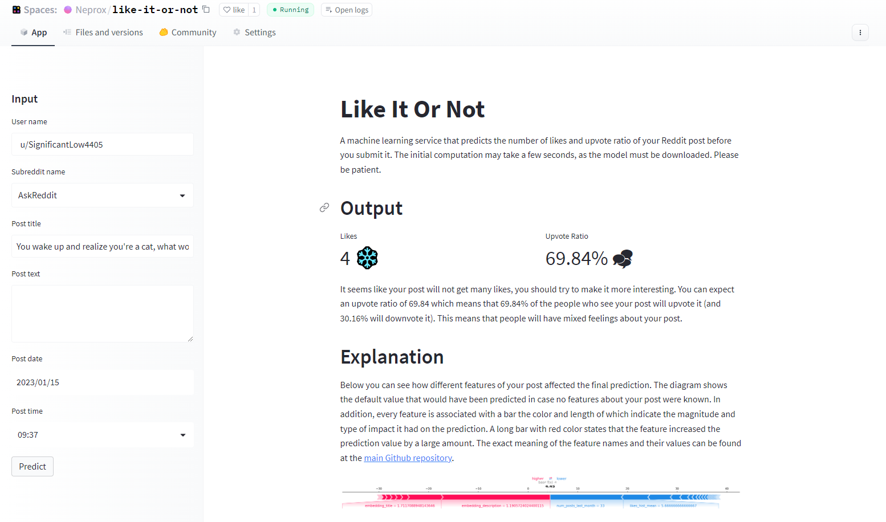
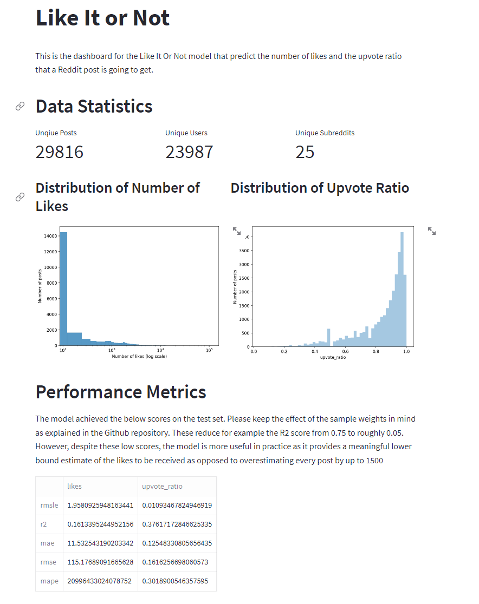
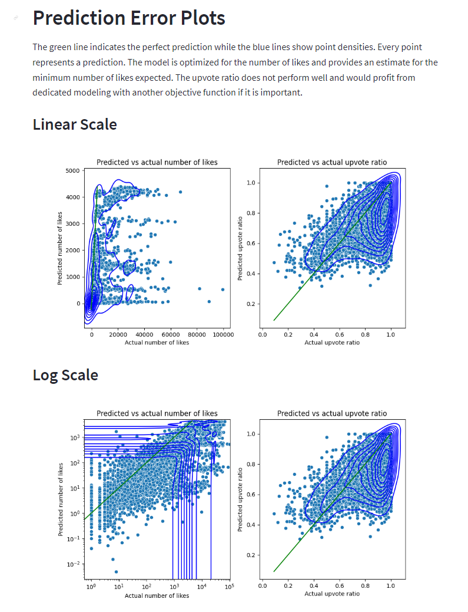

# LikeItOrNot

Scalable machine learning system to predict the number of likes a reddit post or comment is going to get if the user decides to post it. The service consists of several components:

## Feature Pipeline

The feature pipeline is deployed on modal and run on a daily schedule. It scans a set of subreddits for new posts / comments, pre-processes them and adds them to the feature store on hopsworks.

A long list of subreddits are crawled on a daily basis, these include for example:

- /r/AskReddit
- /r/explainlikeimfive
- /r/Showerthoughts

The script extracts data for three entity types that are stored in their individual table namely reddit_users, reddit_posts and reddit_subreddits. Some of the features represent e.g. the raw text and are only kept for plausibilisation reasons. See the enumeration and description of all features below.

In case a lot of samples should be crawled in a short time, it is possible to schedule many instances of the feature pipeline that extract samples from different subreddits which leads to a very scalable system.

### reddit_posts

- `post_id`: Uniquely identifies the post / submission on reddit.
- `user_id`: Uniquely identifies the user that created the post.
- `subreddit_id`: Uniquely identifies the subreddit that the post was created in.
- `snapshot_time`: The time when the post was crawled. The same for associated entries in all three tables.
- `num_likes`: The number of upvotes the post received. This is the <strong>`primary label`</strong> we want to predict.
- `upvote_ratio`: The ratio of upvotes to downvotes which indicates how controversial a post is. This is a <strong>`secondary label`</strong> we want to predict.
- `date_created`: The time when the post was created on reddit.
- `link`: The URL to the post on reddit.
- `title`: The title of the post as string.
- `text`: The text of the post as string.
- `text_length`: The length of the text of the post in number of tokens (that correspond to words most of the time).
- `text_sentiment_negative`: The negative sentiment of the post text as float in the range [0, 1]. Obtained with [cardiffnlp/twitter-roberta-base-sentiment-latest](https://huggingface.co/cardiffnlp/twitter-roberta-base-sentiment-latest).
- `text_sentiment_neutral`: The neutral sentiment of the post text as float in the range [0, 1]. Obtained with [cardiffnlp/twitter-roberta-base-sentiment-latest](https://huggingface.co/cardiffnlp/twitter-roberta-base-sentiment-latest).
- `text_sentiment_positive`: The positive sentiment of the post text as float in the range [0, 1]. Obtained with [cardiffnlp/twitter-roberta-base-sentiment-latest](https://huggingface.co/cardiffnlp/twitter-roberta-base-sentiment-latest).
- `title_sentiment_negative`: The positive sentiment of the post title as float in the range [0, 1]. Obtained with [cardiffnlp/twitter-roberta-base-sentiment-latest](https://huggingface.co/cardiffnlp/twitter-roberta-base-sentiment-latest).
- `title_sentiment_neutral`: The positive sentiment of the post title as float in the range [0, 1]. Obtained with [cardiffnlp/twitter-roberta-base-sentiment-latest](https://huggingface.co/cardiffnlp/twitter-roberta-base-sentiment-latest).
- `title_sentiment_positive`: The positive sentiment of the post title as float in the range [0, 1]. Obtained with [cardiffnlp/twitter-roberta-base-sentiment-latest](https://huggingface.co/cardiffnlp/twitter-roberta-base-sentiment-latest).
- `contains_tldr`: Whether the post contains a "tldr" (too long, didn`t read) section.
- `hour_of_day`: The hour of the day when the post was created.
- `day_of_week`: The day of the week when the post was created.
- `embedding_text`: The 384-dimensional embedding of the text of the post (taking only the first 512 tokens into account). Obtained with [sentence-transformers/paraphrase-MiniLM-L6-v2](https://huggingface.co/sentence-transformers/paraphrase-MiniLM-L6-v2).
- `embedding_title`: The 384-dimensional embedding of the title of the post (taking only the first 512 tokens into account). Obtained with [sentence-transformers/paraphrase-MiniLM-L6-v2](https://huggingface.co/sentence-transformers/paraphrase-MiniLM-L6-v2).

### reddit_users

- `user_id`: Uniquely identifies the user on reddit.
- `snapshot_time`: The time when the user was crawled. The same for associated entries in all three tables.
- `user_name`: The name of the user on reddit.
- `comment_karma`: The number of upvotes the user received for comments.
- `link_karma`: The number of upvotes the user received for posts.
- `is_gold`: Whether the user has premium status.
- `is_mod`: Whether the user is a moderator of any subreddit.
- `has_verified_email`: Whether the user has verified their email address.
- `account_age`: The age of the account in days.
- `num_posts_last_month`: The number of posts the user created in the last month (we chose 50 to be the max).
- `likes_hist_mean`: The mean of the number of likes the user received for their posts in the last month. Placeholder value of -999 if no posts exist in that period.
- `likes_hist_stddev`: The standard deviation of the number of likes the user received for their posts in the last month. Placeholder value of -999 if no posts exist in that period.
- `likes_hist_median`: The median of the number of likes the user received for their posts in the last month. Placeholder value of -999 if no posts exist in that period.
- `likes_hist_80th_percentile`: The 80th percentile of the number of likes the user received for their posts in the last month. Placeholder value of -999 if no posts exist in that period.
- `likes_hist_20th_percentile`: The 20th percentile of the number of likes the user received for their posts in the last month. Placeholder value of -999 if no posts exist in that period.

### reddit_subreddits

- `subreddit_id`: Uniquely identifies the subreddit on reddit.
- `snapshot_time`: The time when the subreddit was crawled. The same for associated entries in all three tables.
- `subreddit_name`: The name of the subreddit on reddit.
- `num_subscribers`: The number of subscribers to the subreddit.
- `sentiment_negative_mean`: The mean of the negative sentiment of the most recent top posts in the subreddit.
- `sentiment_negative_stddev`: The standard deviation of the negative sentiment of the most recent top posts in the subreddit.
- `sentiment_negative_median`: The median of the negative sentiment of the most recent top posts in the subreddit.
- `sentiment_negative_80th_percentile`: The 80th percentile of the negative sentiment of the most recent top posts in the subreddit.
- `sentiment_negative_20th_percentile`: The 20th percentile of the negative sentiment of the most recent top posts in the subreddit.
- `sentiment_neutral_mean`: The mean of the neutral sentiment of the most recent top posts in the subreddit.
- `sentiment_neutral_stddev`: The standard deviation of the neutral sentiment of the most recent top posts in the subreddit.
- `sentiment_neutral_median`: The median of the neutral sentiment of the most recent top posts in the subreddit.
- `sentiment_neutral_80th_percentile`: The 80th percentile of the neutral sentiment of the most recent top posts in the subreddit.
- `sentiment_neutral_20th_percentile`: The 20th percentile of the neutral sentiment of the most recent top posts in the subreddit.
- `sentiment_positive_mean`: The mean of the positive sentiment of the most recent top posts in the subreddit.
- `sentiment_positive_stddev`: The standard deviation of the positive sentiment of the most recent top posts in the subreddit.
- `sentiment_positive_median`: The median of the positive sentiment of the most recent top posts in the subreddit.
- `sentiment_positive_80th_percentile`: The 80th percentile of the positive sentiment of the most recent top posts in the subreddit.
- `sentiment_positive_20th_percentile`: The 20th percentile of the positive sentiment of the most recent top posts in the subreddit.
- `embedding_description`: The embedding of the description of the subreddit. Obtained with [sentence-transformers/paraphrase-MiniLM-L6-v2](https://huggingface.co/sentence-transformers/paraphrase-MiniLM-L6-v2).

## Training Pipeline

We use an XGBoost regressor as the prediction model and select its hyperparameters using Bayesian Optimization on a separate validation set. The decision for XGBoost is rooted in its general modeling power and its efficient training process that allows for extensive hyperparameter search. In addition to that, this tree based model can be explained using the SHAP library for machine learning explainability. As a consequence, we can see the magnitude and type of impact of the different features on the predictions. In particular, we can give an immediate explanation of the prediction to user in the UI and give advice on how to improve the post (e.g. changing the time of day of posting on Reddit).

In addition to the XGBoost model, we post-process the predictions to reflect the fact that the upvote ratio can only be within the range [0,1].

### Handling imbalances

The massive imbalance between the number of likes on top posts and on low quality posts makes training very difficult. XGBoost offers only a selected number of objective functions like mean squared error or mean squared log error. The former biases heavily towards posts with few likes so that there are no predictions beyond 200 likes (even though they can have up to 100,000 likes). The latter biases towards posts with many likes such that almost no posts have less than 50 likes (even though most have). A tradeoff like mean absolute error is not possible, as this metric is not twice differentiable.

For that reason, we introduce a weight for every sample x in the training set that is the reciprocal of the number of likes to the power of 9/8: $w(x) = 1/\sqrt[8]{x^9_{likes}}$. After extensive experimentation we noticed that the sample weights $w(x) = 1/x_{likes}$ and $w(x) = 1/x_{likes^2}$ suffer from the same problems as the metrics described in the previous section, as they bias too heavily. On the other hand, the proposed sample weighting allows the model to predict up to 2000 number of likes while being very conservative in outputting high numbers. This is enough to distinguish top performing posts and bad posts which is the original question the user is interested in. In general, the prediction can be seen as a lower bound on the number of likes to be expected instead of the exact number of likes.

It should be noted though, that common error metrics (e.g. R2) will exhibit large errors with this approach that may lead one to the false conclusion that the model was not powerful enough. Below you can see the comparison of predicted vs actual values for a model with and without the described weighting. The green line indicates a perfect prediction and the blue lines show the areas of highest point densities. The right plots differ only in terms of log scale for the x and y axis.

**Predicted vs actual `without sample weighting` (R2=0.801)**


**Predicted vs actual with samples `weighted by inverse number of likes` (R2=0.04)**



Note how the model with weighted samples tends to underestimate the number of likes which is much less problematic than overestimating them.

## Inference Pipeline / UI

An interactive UI allows the user to enter the content of his/her post or comment alongside his profile. The service will then extract the necessary features, query the model and display the number of likes to be expected. To prevent inconsistencies between feature extraction in the feature pipeline and the UI, the frontend application accesses the same processing code from the main repository through a git submodule. The model itself is packed together with all model-specific feature transformation functions into an sklearn pipeline to avoid training-inference skew.

If you choose to deploy this UI yourself, do not forget to add the Hopsworks and Reddit environment variables to the Huggingface space as mentioned further below.

## MLOps

At the end of the feature pipeline, the extracted data is tested against a set of expectation rules using the `Great Expectations` framework. Such tests include for example whether the text embeddings consist of arrays of length 384 or if all columns have the correct data type. That way, we can be confident that the newly added data has sufficient quality. In Hopsworks it is possible to activate alerts that trigger on validation events. Alternatively, the user can always view the results in the Hopsworks UI for the feature groups.

We use continuous integration (CI) with Github actions to execute a number of unit tests on every commit. Since extracting features from posts is not deterministic over time, we cannot test for the actual values extracted. Imagine for example that a user is deleted. We use an archived post for testing to minimize the risk of the tests failing for legitimate reasons. The main purpose of the tests is to check whether extraction is still possible after a Github commit was done and that the extracted data is not empty. Similarly, we test whether a model can be trained successfully.

After the tests were run successfully, we use continuous deployment (CD) to update the feature pipeline deployment on modal within the Github workflow.

## Running the script

Firstly, if you want to run the scripts locally, make sure to have created a .env file that contains the necessary environment variables namely. If you plan on running the scripts on modal, you have to add the environment variables there. <span style="color:red">Add all of them to the same secret called "reddit-predict"</span>.

- `HOPSWORKS_API_KEY`
- `REDDIT_CLIENT_SECRET`
- `REDDIT_CLIENT_ID`
- `REDDIT_USER_AGENT`

Optionally, you can add the following environment variables to indicate the version of the feature group to use:

- `POSTS_FG_VERSION`
- `USERS_FG_VERSION`
- `SUBREDDITS_FG_VERSION`
- `FEATURE_VIEW_VERSION`

You may also add the below environment variables for Modal. To use automatic deployment with github workflows, it is necessary to add all the hopsworks, reddit and modal environment variables to the Github repository.

- `MODAL_TOKEN_ID`
- `MODAL_TOKEN_SECRET`

Secondly, this repository contains a Dockerfile to build a container for this tool that runs in any local environment. In order to use it, simply run the below command which builds the container, starts it and provides you with a terminal inside the container where you can run the scripts from. In case of development, you can modify files locally and the changes will come into effect inside the container immediately. Note that building the container can take up to 15 minutes due to the large requirements.

```console
docker compose run reddit-predict
```

In case you want to run the script on `modal` and you have not added the modal environment variables, you have to execute the following commandsafter you started the container and follow the instructions. It will generate a new token that the container needs to authenticate itself to modal. Also, do not forget to set `RUN_ON_MODAL=True`.

```console
modal token new
```

## Possible future improvements

As the system keeps running for longer time, it becomes necessary to check whether the distribution of the data changes over time. Also, the train / test / validation splits should take into account that the data is temporal and should be splitted that way. However, this is only possible when the system has gathered data over a period of time that is sufficiently long. The main reason is that top posts are much rarer than trash posts and thus to learn to predict higher number of likes, we incorporated top posts from all months of 2022 whereas most trash posts are from December 2022. This imbalance is a natural limitation of the api we used and because of it a temporal split does not make sense at this point. At a future point it would be possible to detect different kinds of drifts.

## Screenshots

Hopsworks regularly has connection issues which can render the services implemented in this repository unusable. If that is the case at the time you are trying it out, here are screenshots of the interactive UI and the dashboard:

### Interactive UI



### Dashboard




